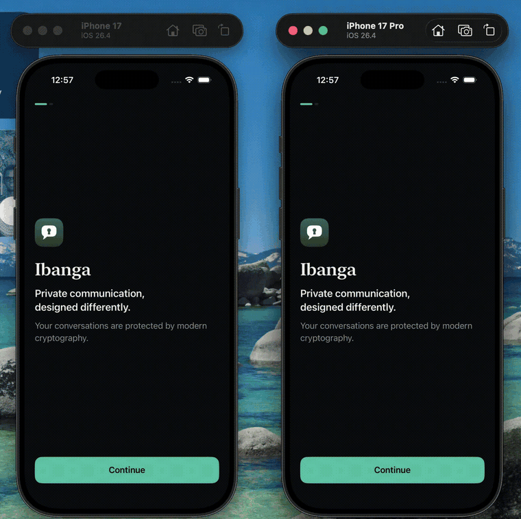
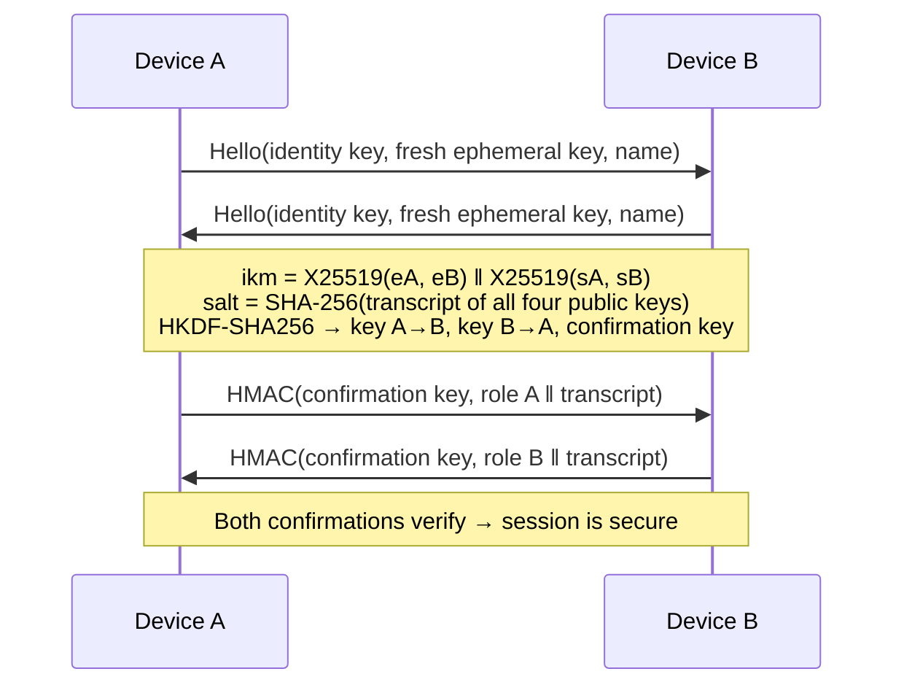
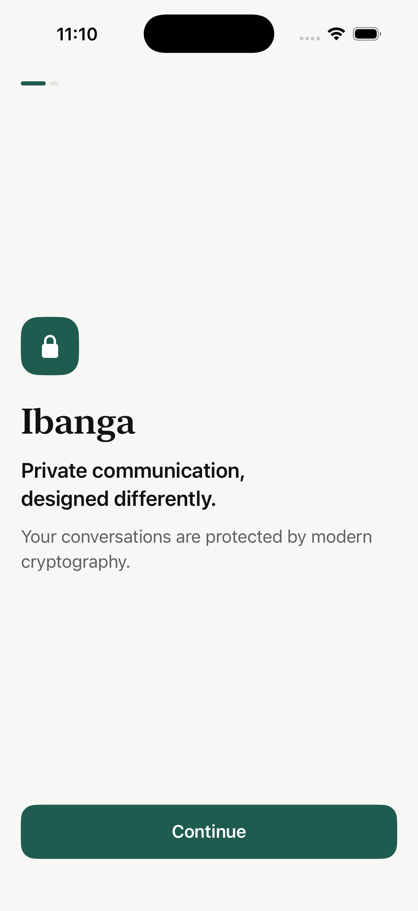
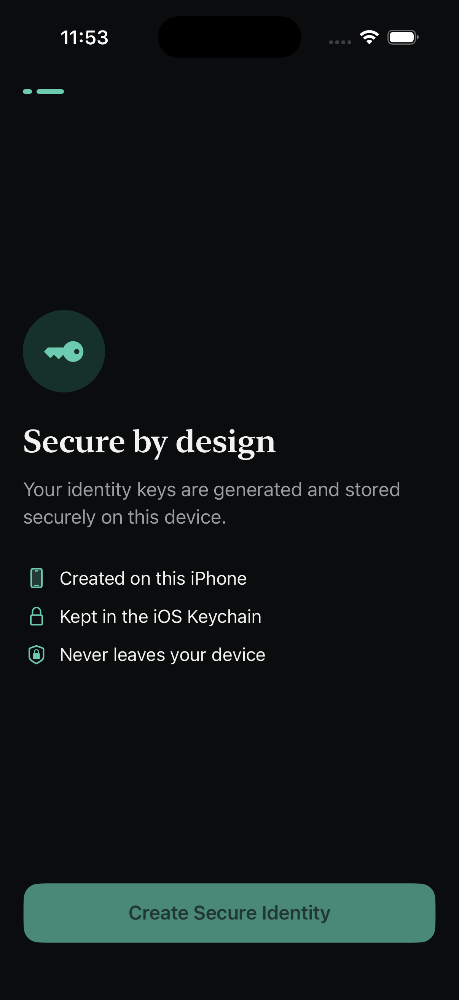
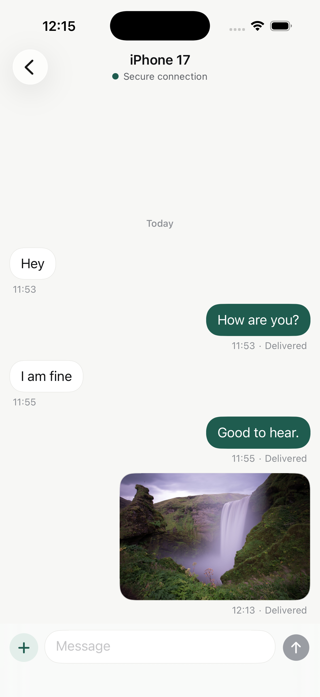

# Ibanga Chat

> Private communication, designed with security at the core.

Ibanga is a security-focused iOS messaging prototype built with native Apple technologies. Two nearby iPhones discover each other, authenticate, and exchange end-to-end encrypted text, photos and files. There is no server, no account and there are no third-party dependencies.

<p align="center">
  
</p>

<p align="center"><sub>Two simulators pairing, establishing a secure session, and exchanging encrypted messages and a photo.</sub></p>

> **Run it on your Mac:** install Xcode 26.4 or later, then run `./scripts/setup.sh && ./scripts/run-simulators.sh`. See [Getting Started](#getting-started) for the full guide.

---

## Overview

| | |
|---|---|
| Platform | iOS 17+, SwiftUI, Swift 6 (strict concurrency) |
| Cryptography | CryptoKit: X25519, HKDF-SHA256, AES-256-GCM, HMAC-SHA256 |
| Key storage | iOS Keychain, device-only, never synced |
| Transport | Network.framework: Bonjour discovery + TCP |
| Persistence | SwiftData; message and attachment content encrypted at rest |
| Dependencies | None |

## Product Philosophy

Security is not a feature toggle. The user never chooses to "encrypt", and there is no insecure mode to fall back to:

- **Secure by default.** Every connection is authenticated and every payload is encrypted before it reaches the network layer.
- **Fail closed.** If a key is missing, a handshake doesn't verify, or a message fails authentication, nothing is sent and nothing is displayed.
- **Simple on the surface.** Cryptographic detail is available in the Security screens, but it never gets in the way of the conversation.

## Features

- **Onboarding** that creates a device identity in the Keychain.
- **Nearby discovery** over Bonjour, with a display name you can edit.
- **Authenticated secure sessions** with live connection states: *Connecting… → Establishing secure session… → Secure connection established*.
- **Automatic reconnection** to known peers when they come back into range.
- **Encrypted text messaging** with grouping, day separators, delivery states (*Sending → Sent → Delivered*) and retry for failed messages.
- **Unread tracking**: count badges in the conversation list, and a "N unread messages" divider when you open a chat.
- **Search** across conversation names and message text, performed in memory over decrypted content.
- **Attachment tray** (Photos · Camera · Document) that springs up from the composer.
- **Photo attachments** from PhotosPicker or the camera. Photos are resized, re-encoded and stripped of EXIF/GPS metadata before encryption, and open in a full-screen viewer with zoom.
- **File attachments** from the Files app (up to 25 MB), shown with type and size and opened in Quick Look.
- **Real transfer progress** for attachments, on both the sending and receiving device.
- **Peer verification**: a 12-digit code derived from both identity keys, which can be marked as verified.
- **Security screen** showing the device fingerprint, protection details, live connection status and an on-device cryptographic self-check.
- **Settings**: change your display name, and choose System, Light or Dark. The theme is applied at the window level, so system screens such as Quick Look and the photo picker follow it too.
- **An original app icon**: a speech bubble with a keyhole. It's drawn once as a SwiftUI `Shape`, used in the app, and rendered into the icon (light, dark and tinted) by `scripts/generate-app-icon.sh`.
- **Light and Dark mode**, Dynamic Type, VoiceOver labels, Reduce Motion support and haptics.

## Architecture

**Feature-first, with a layered architecture inside each feature** (MVVM + Clean Architecture). `Core/` holds only what more than one feature needs. Features never refer to each other; navigation between them is injected by the composition root.

```
IbangaChat/
├── App/                 Composition root (AppContainer), app state, root view
├── Core/                Shared by every feature
│   ├── Crypto/          KeychainService, KeyAgreementService, EncryptionService, CryptoService
│   ├── Networking/      NetworkService (Bonjour + TCP), NetworkConnection, NetworkPacket
│   ├── Persistence/     PersistenceController, SwiftData models
│   ├── Logging/         SecureLogger
│   ├── DesignSystem/    Colors, typography, spacing, icons, components
│   ├── Domain/          Shared entities, repository contracts, LoadIdentityUseCase
│   ├── Data/            IdentityRepository, SessionRepository, ChatRepository, wire protocol
│   └── Presentation/    Shared presentation helpers
└── Features/
    ├── Onboarding/      Domain · Presentation
    ├── Conversations/   Presentation
    ├── Pairing/         Domain · Presentation
    ├── Chat/            Domain · Data (media) · Presentation
    ├── Settings/        Domain · Presentation
    └── Security/        Domain · Data · Presentation
```

### Architecture Diagram

```mermaid
flowchart TD
    V[SwiftUI View] --> VM[ViewModel<br/>@Observable]
    VM --> UC[Use Case<br/>business rules]
    UC --> R[Repository<br/>ChatRepository · SessionRepository]
    R --> C[CryptoService<br/>actor]
    R --> N[NetworkService<br/>actor]
    R --> P[(SwiftData)]
    C --> K[(Keychain)]
    N --> NF[Network.framework]
```

Key decisions:

- **Actors** isolate mutable state that crosses threads: `CryptoService` owns the private key; `NetworkService` owns the sockets.
- **The main actor is the default isolation.** Every closure handed to Network.framework or UIKit is explicitly `@Sendable` or `nonisolated`, so the runtime never sees a main-actor closure running on a background queue.
- **Observable repositories** (`@Observable`, main actor) give several screens a live view of the same connection and conversation state.
- **Typed throws** (`throws(CryptoError)`, `throws(SessionError)`, `throws(ChatError)`) turn failures into specific, user-facing messages.

## Security Architecture

```
 UI ──▶ Use cases ──▶ ChatRepository ──▶ SessionRepository ──▶ NetworkService ──▶ TCP
                          │                    │
                          ▼                    ▼
                 CryptoService (storage)   CryptoService (session)
                          │                    │
                          └────── Keychain ────┘
```

The network layer only ever receives sealed bytes. There is exactly one transmit path, and it carries three kinds of packet:

1. a handshake hello (public keys and display name),
2. a key confirmation (an HMAC),
3. encrypted messages.

## Cryptographic Approach

Ibanga uses modern cryptographic primitives provided by Apple's CryptoKit. It does **not** implement the Signal Protocol.

### Session establishment



| Property | How |
|---|---|
| **Authentication** | Only the holder of an identity private key can compute the identity–identity X25519 secret. Key confirmation proves this before anything is sent. An impostor who presents someone else's public key cannot produce a valid confirmation. |
| **Forward secrecy per connection** | Every connection mixes in fresh ephemeral keys, so a later compromise of an identity key does not reveal past session keys. |
| **Key separation** | HKDF with distinct `info` labels derives a separate key for each direction plus a confirmation key. A message reflected back to its sender fails authentication. |
| **Transcript binding** | The HKDF salt hashes all four public keys in canonical order, so both devices must agree on the exact handshake. |
| **Invalid key rejection** | Low-order points (all-zero shared secrets) and "peer key equals my own key" are rejected. |
| **Identity pinning** | When dialling a known device, the identity proven in the handshake must match the fingerprint it advertised; otherwise the connection is dropped. |

### Message encryption

- **AES-256-GCM** with a random 96-bit nonce per fragment.
- **Authenticated header.** The envelope header (message ID, sequence number, timestamp) is bound to the ciphertext as associated data, so changing any of it breaks decryption.
- **Hidden content type.** Whether a message is text, a photo, a file or a receipt is only visible inside the ciphertext.
- **Replay protection.** Sequence numbers must strictly increase.
- **Tamper response.** Any authentication failure discards the message and tears down the session.

### Verification code

`SHA-256("IbangaChat/v1/verification-code" ‖ lower identity key ‖ higher identity key)` is reduced to 12 decimal digits. It is identical on both devices and stable across connections, so users can compare it in person.

## Key Management

| Key | Where | Lifetime |
|---|---|---|
| Identity key (X25519) | Keychain · `WhenUnlockedThisDeviceOnly` · not synchronisable | Created once and never replaced silently. Damaged key material is an error, not an excuse to mint a new identity. |
| Storage key (AES-256) | Keychain, same attributes | Created on first use. Encrypts content at rest. |
| Ephemeral keys | Memory only | One per connection |
| Session keys | Memory only; opaque `SecureSession` type with redacted descriptions | Until the connection closes |

- **`KeychainService` is the only code that talks to the Keychain.**
- **Private keys never leave `CryptoService`.** `PendingHandshake` and `SecureSession` expose their key material only inside the crypto core.
- **Fresh install, fresh identity.** Keychain items survive app deletion while app data does not, so the first launch after a new install purges any identity left over from a previous one.

## Secure Communication

- **Discovery.** Bonjour advertises the service `_ibanga._tcp` with a TXT record containing the identity fingerprint. The fingerprint is unauthenticated: it's only used to find a device, and the handshake then proves it.
- **Framing.** Packets are `[kind: 1 byte][length: 4 bytes, big-endian][payload]`, capped at 8 MB.
- **Fragmentation.** Payloads larger than 256 KB are split into fragments. Each fragment is sealed and sequenced on its own, and the receiver reassembles them strictly in order with bounded size and count. This is what drives the progress indicators on both devices.
- **Simultaneous dialling.** When both devices dial each other at once, a deterministic rule means both keep the same connection: the connection started by the lower fingerprint wins.
- **Reconnection.** Only the peer with the lower fingerprint re-dials automatically. A failed session is never retried without the user.
- **No plaintext fallback.** Without a secure session, sending throws `.notConnected` / `.notSecure`, and the UI explains why.

## Attachment Security

```
Photo ─▶ ImageIO re-encode (≤ 2048 px, JPEG, no EXIF/GPS) ─▶ encrypt ─▶ fragments ─▶ network
                                                              receive ─▶ authenticate ─▶ reassemble ─▶ validate ─▶ store encrypted ─▶ render
```

Received attachments are validated before they are stored:

- **Size.** The byte count must match the declared metadata and be at most 25 MB.
- **Images.** A declared image must actually decode, and its dimensions are checked before any pixels are allocated. This blocks decompression bombs.
- **Filenames.** Path components, control characters and Unicode bidirectional overrides are stripped, and leading dots are removed. This defeats `../` traversal and `photo‮gpj.exe`-style spoofing.

Opened files are decrypted to a temporary file with `completeFileProtection`. It is deleted when Quick Look closes, and again at the next launch.

## Local Persistence

- **SwiftData models:**
  - `PeerRecord`: public key, fingerprint, name, verified flag.
  - `ConversationRecord`
  - `MessageRecord`: *sealed* body.
  - `AttachmentRecord`: *sealed* bytes in external storage.
- **Encryption at rest.** Message and attachment content is encrypted with the Keychain storage key. The associated data binds each ciphertext to its record ID, so encrypted bodies can't be swapped between records.
- **Decrypted only in memory.** Content is decrypted when a conversation is opened. Anything that fails authentication is not displayed.
- **No plaintext search index.** Search decrypts in memory and never writes an index to disk. Read state is a plain boolean that reveals nothing about content.
- **Not in backups or iCloud.** The store is excluded from backups and CloudKit sync is disabled. It would be useless off-device anyway, because the keys are device-only.

## Getting Started

### Quick start

On a Mac that already has Xcode 26.4 or later:

```bash
git clone <repo-url> IbangaChat
cd IbangaChat
./scripts/setup.sh              # one time: checks tools, creates simulators, test build
./scripts/run-simulators.sh     # builds and launches the app on two simulators
```

### Required tools

| Tool | Version | Notes |
|---|---|---|
| **Mac** | Apple silicon or Intel | About 30 GB of free disk space for Xcode and the iOS Simulator |
| **macOS** | 15.6 (Sequoia) or later | Required by Xcode 26 |
| **Xcode** | **26.4 or later** | Mac App Store or [developer.apple.com/xcode](https://developer.apple.com/xcode/). Includes Swift 6.2, the iOS 26 SDK and the command-line tools. |
| **iOS Simulator runtime** | iOS 26.x | Installed with Xcode, or by `setup.sh` |
| **Git** | Any | Included with Xcode |

**Not required:** Homebrew, CocoaPods, Swift packages, Node or Ruby. The project has no third-party dependencies. An Apple Developer account is only needed to run on a physical iPhone.

### Step by step on a new Mac

1. **Install Xcode 26.4 or later** from the Mac App Store.
2. **Open Xcode once.** Accept the license and let it install its components. When asked which platforms to download, pick **iOS**.
3. **Clone the repository:**
   ```bash
   git clone <repo-url> IbangaChat
   cd IbangaChat
   ```
4. **Run the setup script:**
   ```bash
   ./scripts/setup.sh
   ```
   It asks before anything that needs `sudo` or a large download. Use `./scripts/setup.sh --yes` to accept every step automatically.
5. **Launch the app on two simulators:**
   ```bash
   ./scripts/run-simulators.sh
   ```

### What `setup.sh` does

| Step | Check | Fixes automatically (after asking) |
|---|---|---|
| 1 | macOS is 15.6 or later | — |
| 2 | The full Xcode 26.4+ is installed and selected (not just the Command Line Tools) | — (prints the `xcode-select` command) |
| 3 | The Xcode license is accepted | `sudo xcodebuild -license accept` |
| 4 | Xcode's first-launch components are installed | `sudo xcodebuild -runFirstLaunch` |
| 5 | An iOS Simulator runtime is installed | `xcodebuild -downloadPlatform iOS` |
| 6 | The **iPhone 17** and **iPhone 17 Pro** simulators exist | `xcrun simctl create …` |
| 7 | The project builds | — (prints the errors and the path to the log) |

### Scripts

| Script | Purpose |
|---|---|
| `./scripts/setup.sh [--yes]` | One-time environment check and preparation |
| `./scripts/run-simulators.sh` | Build once and launch the app on both simulators side by side |
| `./scripts/run-simulators.sh --reset` | Uninstall first: fresh onboarding and new identities on both devices |
| `./scripts/generate-app-icon.sh` | Re-render the app icon from `IbangaLogoShape` |

To use other simulators (for example on an older Xcode), set `IBANGA_SIMULATORS` for both scripts:

```bash
IBANGA_SIMULATORS="iPhone 16,iPhone 16 Pro" ./scripts/setup.sh
IBANGA_SIMULATORS="iPhone 16,iPhone 16 Pro" ./scripts/run-simulators.sh
```

### Trying it out

1. Complete onboarding on both simulators (**Continue** → **Create Secure Identity**).
2. On one simulator, tap **Connect Device** and choose the other device.
3. Exchange messages. Tap **+** for **Photos** or **Document**.
4. Tap the name in the chat header to compare verification codes, and **Mark as Verified**.
5. Open **Settings** (gear icon) to change your name, switch between Light and Dark, or open **Security & Privacy** to see the on-device cryptographic self-check.

### Running from Xcode

Open `IbangaChat.xcodeproj`, choose the **IbangaChat** scheme and a simulator, then press **⌘R**. To see two devices talking, run it on one simulator, then choose a second simulator and press **⌘R** again.

### Running on a physical iPhone

1. Connect the iPhone and enable **Developer Mode** (Settings › Privacy & Security).
2. In Xcode, select the **IbangaChat** target › *Signing & Capabilities*:
   - choose your own **Team**;
   - change the **Bundle Identifier** to something unique, e.g. `com.yourname.IbangaChat`.
3. Build and run (**⌘R**). When the app first asks for **Local Network** access, choose **Allow**. Ibanga needs it to discover nearby devices.
4. Both devices must be on the **same Wi‑Fi network** with Ibanga open.

### Troubleshooting

| Symptom | Fix |
|---|---|
| `No available simulator named 'iPhone 17'` | Run `./scripts/setup.sh`, or choose other devices with `IBANGA_SIMULATORS`. |
| `xcode-select` points to `CommandLineTools` | `sudo xcode-select --switch /Applications/Xcode.app/Contents/Developer` |
| Devices don't appear in **Connect Device** | Keep Ibanga open and in the foreground on both devices, on the same network. On an iPhone, check Settings › Privacy & Security › Local Network › Ibanga. |
| Old conversation stays "Not connected" after a reinstall | A reinstall creates a new identity, so the old conversation can't reconnect. Pair again from **Connect Device**, or run `./scripts/run-simulators.sh --reset` to start both devices fresh. |
| Build output shows "device is locked" errors | A locked iPhone is plugged into the Mac. This is harmless; unlock it or disconnect it. |
| Anything else in the build | See `build/xcodebuild.log` (run script) or `build/setup-build.log` (setup script). |

## Security Considerations

The on-device self-check (Security screen) runs 10 checks:

- Known-answer tests against **RFC 7748** (X25519) and **RFC 5869** (HKDF).
- Session key agreement.
- Rejection of invalid peer keys.
- Separate keys per direction and fresh keys per connection.
- Impostor rejection.
- AES-GCM round trip.
- Tamper rejection.
- Associated-data binding.

Other safeguards:

- **Logging.** `SecureLogger` accepts only a fixed set of events, so there is no API that could log message text, keys or attachment bytes.
- **Error messages.** Errors shown to the user are translated into plain, non-alarming language. Detailed codes appear only in logs, as stable non-sensitive identifiers.

## Known Limitations

This is a technical prototype, not a production messenger:

- No backend relay; communication is peer-to-peer on the local network only, and both apps must be in the foreground.
- No push notifications and no offline delivery. Messages to an unreachable peer fail and can be retried.
- Not the Signal Protocol: there is no Double Ratchet and no prekeys, so forward secrecy is per connection rather than per message, and there is no post-compromise security.
- Authentication is trust-on-first-use until users compare verification codes.
- A single device identity; no multi-device support and no encrypted backup.
- Limited metadata protection: display names and fingerprints are visible on the local network via Bonjour, and packet sizes and timing are observable.
- Attachments are held in memory while they are sent, received and stored (up to 25 MB); true streaming would need further work.
- Sends are serialised per connection, so a large attachment delays messages queued behind it.
- A compromised endpoint (a jailbroken or unlocked device) is outside the security boundary.

## Screenshots

| Onboarding | Secure identity (Dark) | Secure conversation |
|---|---|---|
|  |  |  |

## Creativity & Product Decisions

- **Verification that means something.** The code comes from both identity keys, so a man-in-the-middle would produce codes that don't match.
- **Privacy in the details.**
  - Photos lose their GPS location before encryption.
  - Hostile filenames are neutralised.
  - Opened files are decrypted to temporary files that are deleted afterwards.
- **An honest security screen.** Rather than asserting "you're secure", the app verifies its own cryptography on the device against published test vectors.
- **Connection states as product design.** The UI tells users exactly why a message can't be sent, instead of silently queuing it or sending it unprotected.

## Future Improvements

1. Double Ratchet with prekeys, for per-message forward secrecy and post-compromise security.
2. An encrypted relay server for delivery beyond the local network, and to offline peers.
3. Push notifications with encrypted payloads.
4. Multi-device identities and encrypted backup.
5. Streaming attachment encryption for large media.
6. Safety-number change warnings, and QR-code verification.
7. An independent security audit.
